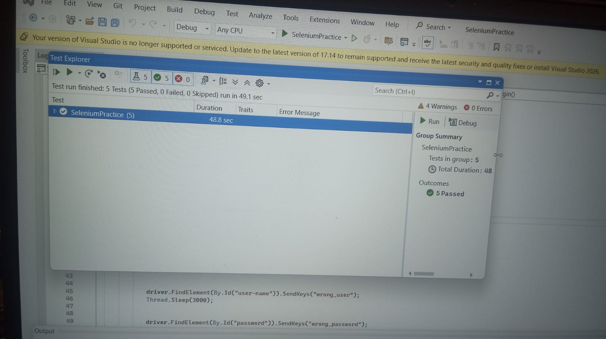

# SauceDemo Selenium NUnit Automation 🚀

A test automation project built using **C#**, **.NET**, **Selenium WebDriver**, and **NUnit** to automate the login functionality of the SauceDemo application.

This project is my first automation testing project as I begin learning **Software Testing and Test Automation in the .NET ecosystem**.

## 🛠 Technologies Used

- C#
- .NET
- Selenium WebDriver
- NUnit Framework
- Visual Studio
- ChromeDriver

## 📌 Project Overview

The project automates different login scenarios of the SauceDemo website:

Application Under Test:
https://www.saucedemo.com/

## ✅ Automated Test Scenarios

The following test cases are covered:

✔ Valid Login  
✔ Invalid Login  
✔ Empty Username and Password Validation  
✔ Username Only Validation  
✔ Password Only Validation  

## 📂 Project Structure

SeleniumPractice
    │
    ├── Dependencies
    └── LoginTests.cs

## 🧪 Testing Approach

The automation framework includes:

- Test Setup and TearDown
- Selenium WebDriver automation
- NUnit test execution
- Reusable test methods

## ▶️ How to Run the Tests

### Prerequisites

Install:

- Visual Studio 2022
- .NET Framework
- Google Chrome Browser

### Run Tests Using Visual Studio 2022

1. Open the solution in **Visual Studio 2022**.
2. Go to **Test → Test Explorer** from the top menu.
3. Wait for the test cases to load.
4. In **Test Explorer**, right-click on the test project.
5. Select **Run** to execute the tests.
6. Check the test results in the Test Explorer window.

 ## 📊 Test Execution Results

All test cases are executed successfully using NUnit Test Runner.

Test cases covered:
- 5 Total Tests
- 5 Passed
- 0 Failed
- 
## Test Execution Output

